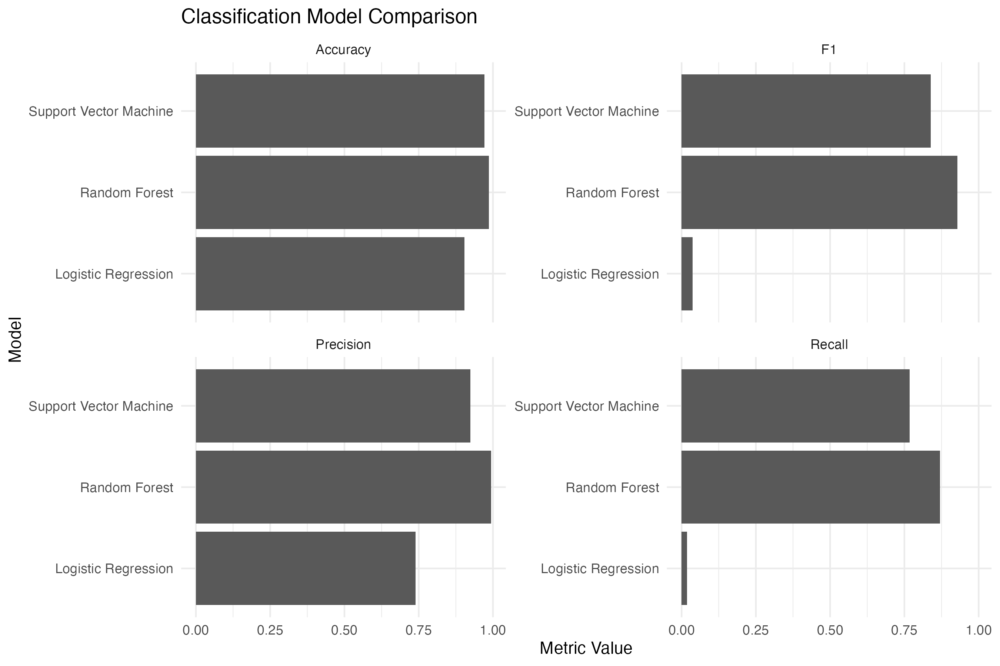
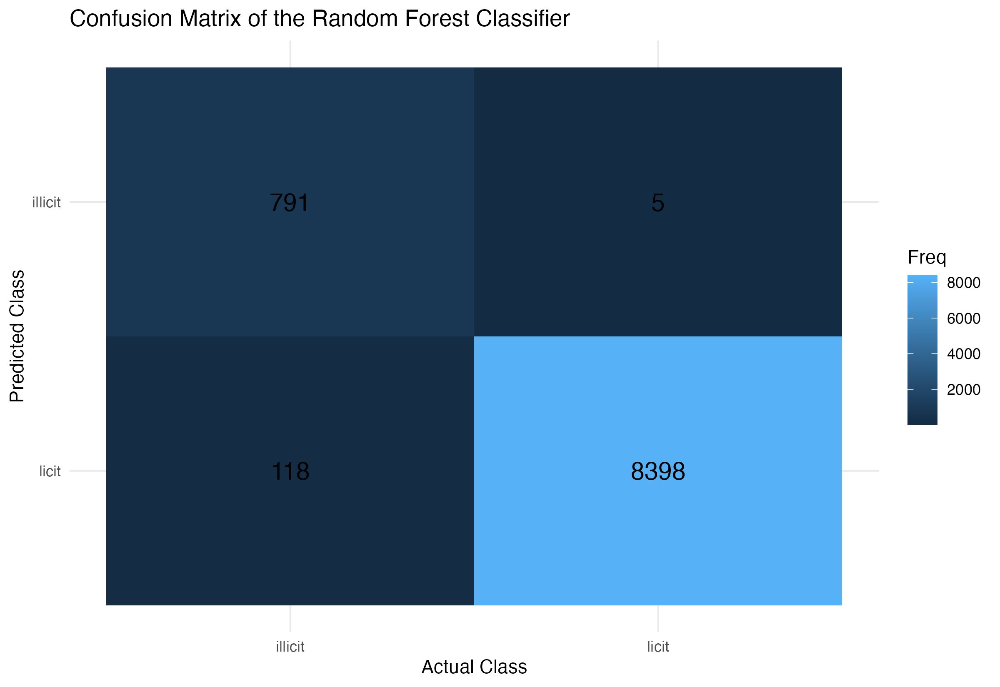
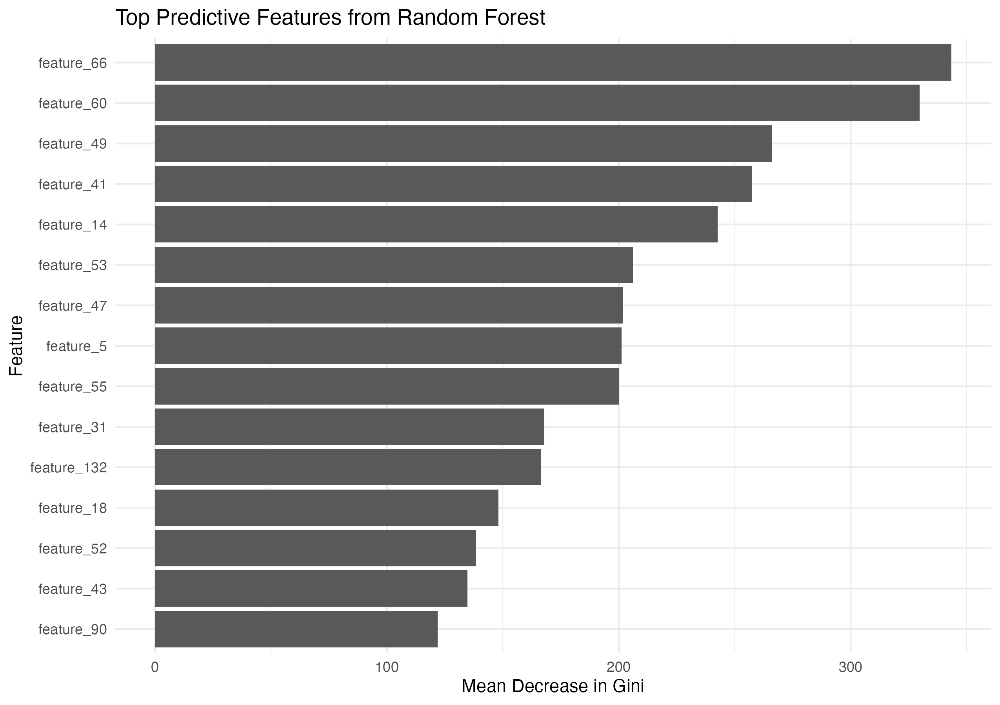

# Machine Learning for Cryptocurrency AML Risk Analysis

Detecting and prioritising potentially illicit Bitcoin transactions using the Elliptic Bitcoin Dataset.

## Project Overview

This project explores how machine learning can support the detection and prioritisation of potentially illicit cryptocurrency transactions in an anti-money-laundering and financial-intelligence context.

The objective is not to treat machine learning as proof of wrongdoing, but to examine how models can support screening, triage, and analytical prioritisation in large transaction environments.

## Dataset

The project uses the Elliptic Bitcoin Dataset, a real-world dataset of Bitcoin transactions with engineered numerical features and transaction class labels.

The dataset includes:

- Illicit transactions

- Licit transactions

- Unknown transactions

The dataset is not included in this repository. It should be downloaded from its original source.

## Methods Used

- Principal Component Analysis

- K-means clustering

- Linear regression

- Ridge regression

- Lasso regression

- Random Forest regression

- Logistic regression

- Support Vector Machine

- Random Forest classification

## Key Results

The Random Forest classifier achieved the strongest classification performance on the labelled subset:

| Metric | Random Forest |

| Accuracy | 98.68% |

| Precision | 99.37% |

| Recall | 87.02% |

| F1-score | 92.79% |

The model correctly identified a high proportion of illicit transactions while maintaining a very low false-positive rate.

## Selected Visuals

### Classification Model Comparison



### Random Forest Confusion Matrix



### Feature Importance



## Repository Structure

```text

crypto-aml-machine-learning/

│

├── README.md

├── LICENSE

├── .gitignore

│

├── report/

│   └── Alejandro_Soba_Crypto_AML_ML_Report.docx

│

├── src/

│   └── crypto_aml_ml_analysis.qmd

│

└── figures/

    ├── 01_class_distribution.png

    ├── 02_pca_projection.png

    ├── 03_clustering_visual.png

    ├── 04_regression_model_comparison.png

    ├── 05_classification_model_comparison.png

    ├── 06_confusion_matrix_rf.png

    └── 07_feature_importance.png
```
